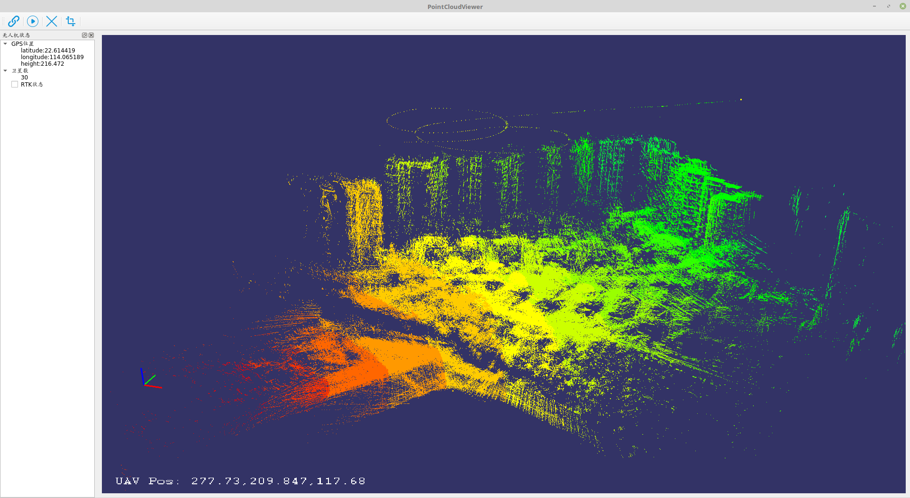

# PointCloudViewer

#### Description
深圳智绘科技研发的一款无人机实时点云显示软件。

A UAV real-time point cloud display software developed by Shenzhen Zhihui Technology Co., Ltd

#### Software Architecture
软件由C++在Linux下编写，利用Qt和OSG搭建界面，可以渲染UDP包中的压缩点云并实时显示无人机状态

The software is written by C++ under Linux. 
Using Qt and OSG to build the interface, it can render the compressed point cloud in the UDP packet and display the status of the drone in real time.

#### Display

#### Prerequisites
1. Draco(https://github.com/google/draco)
2. libssh liblas
3. yaml-cpp
4. OpenSceneGraph 3.2
5. Qt version 5.5 or newer

  Make sure you have a C++11 compliant compiler (gcc 5.5+ / clang)

#### Instructions
1. Clone the project
2. Build
3. Run with -h
